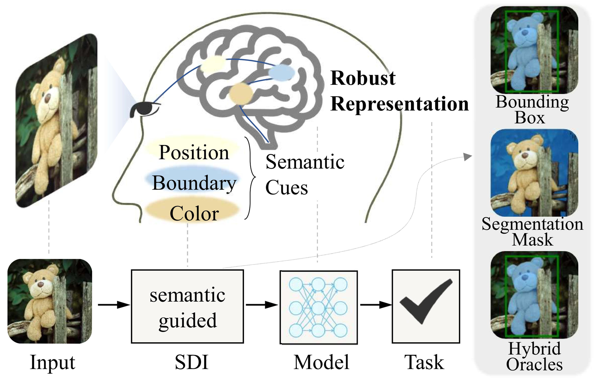
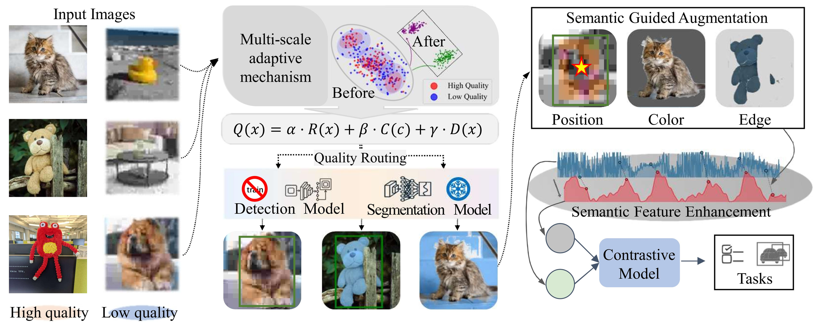
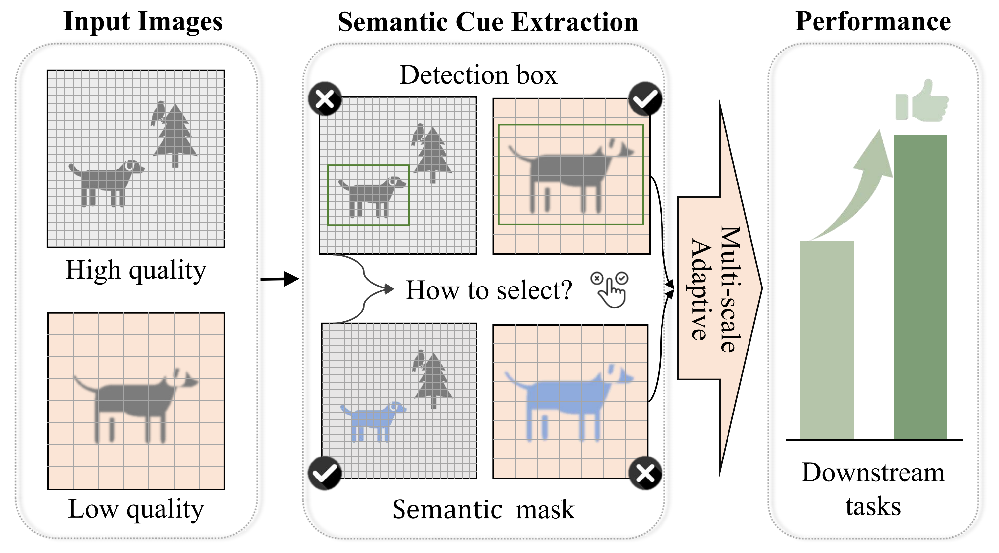

# Semantic Data Inflation (SDI)

<div align="center">

</div>

## A Novel Framework for Self-Supervised Representation Learning

Semantic Data Inflation (SDI) is an adaptive image enhancement technique that automatically selects the appropriate semantic level for data augmentation based on image characteristics. This repository provides the official implementation of our paper:

**"Semantic-Guided Data Augmentation for Self-Supervised Visual Pattern Learning: Leveraging Foundation Model Priors"**

📢 Published in **Pattern Recognition** (2026) — [https://doi.org/10.1016/j.patcog.2026.114822](https://doi.org/10.1016/j.patcog.2026.114822)

## Key Innovations

- 🔍 **Multi-scale Semantic Guidance**: Leverages both object detection and segmentation models to extract rich semantic cues
- 🧠 **Adaptive Mechanism**: Dynamically selects optimal semantic extraction strategies based on image quality and resolution
- 🚀 **Enhanced Performance**: Achieves state-of-the-art results in self-supervised classification (+3.87% on ImageNette)
- ⚡ **Efficient Design**: Significantly more efficient than generative methods while maintaining semantic consistency

## Framework Overview

<div align="center">

<p>The SDI framework extracts multi-level semantic information and applies adaptive augmentation based on image quality characteristics</p>
</div>

## Installation

### Requirements

Create and activate a Python virtual environment:

```bash
conda create -n sdi python=3.8
conda activate sdi
```

Install required dependencies:

```bash
pip install -r requirements.txt
```

### Download Pre-trained Models

```bash
# Download SAM model
wget https://dl.fbaipublicfiles.com/segment_anything/sam_vit_h_4b8939.pth

# YOLO model will be downloaded automatically on first run, or you can pre-download it
python -c "from ultralytics import YOLO; YOLO('yolo11x.pt')"
```

## Usage

### Dataset Preparation

This project supports multiple datasets:

- **CIFAR-10/100**: Automatically downloaded, no additional steps needed
- **ImageNette**: Can be used as a subset of ImageNet for testing
- **Custom datasets**: Organized in standard ImageFolder format

Example for downloading ImageNette dataset:

```bash
# Download and extract ImageNette
wget https://s3.amazonaws.com/fast-ai-imageclas/imagenette2-320.tgz
tar -xzf imagenette2-320.tgz
```

### Basic Usage

For semantic data inflation and downstream contrastive learning, we utilize the solo-learn library for consistent benchmarking:

#### CIFAR-10 Example

```bash
# First, generate semantically inflated data
python semantic_data_inflation.py --data_name cifar10 --train_dir ./data --val_dir ./data

# Then, train with solo-learn
python train.py --model moco --dataset cifar10 --data_dir ./output/cifar10_SDI
```

#### ImageNette Example

```bash
# Generate semantically inflated data
python semantic_data_inflation.py --data_name custom --train_dir ./imagenette2-320/train --val_dir ./imagenette2-320/val

# Train with solo-learn
python train.py --model simclr --dataset imagenette --data_dir ./output/custom_SDI
```

### Advanced Options

#### Adjust Quality Assessment Weights

```bash
# Emphasize resolution factor more
python semantic_data_inflation.py --data_name custom --train_dir ./dataset/train --alpha 0.5 --beta 0.3 --gamma 0.2
```

#### Start Processing from Specific Index

```bash
# Start processing from the 100th image
python semantic_data_inflation.py --data_name custom --train_dir ./dataset/train --image_index 100
```

## Solo-learn Integration

This project leverages the [solo-learn](https://github.com/vturrisi/solo-learn) library for self-supervised learning experiments. Solo-learn provides implementations of various contrastive learning methods (SimCLR, MoCo, BYOL, etc.) with a consistent API.

To use solo-learn with our semantically inflated data:

1. Install solo-learn: `pip install solo-learn`
2. Generate inflated data using our SDI framework
3. Train models using solo-learn's training scripts, pointing to the inflated data directory

Example solo-learn command:

```bash
python train.py \
    --model simclr \
    --dataset custom \
    --data_dir ./output/custom_SDI \
    --batch_size 256 \
    --lr 0.3 \
    --num_workers 4 \
    --max_epochs 400 \
    --gpus 0
```

## Multi-scale Adaptive Mechanism

Our approach dynamically selects the optimal semantic guidance level based on image quality:

<div align="center">

<p>Multi-scale adaptive mechanism for semantic extraction based on image characteristics</p>
</div>

## Results

<div align="center">
<table>
  <tr>
    <th colspan="4">Linear Evaluation Accuracy (%)</th>
  </tr>
  <tr>
    <th>Method</th>
    <th>SimCLR</th>
    <th>MoCo-v2</th>
    <th>BYOL</th>
  </tr>
  <tr>
    <td>Standard Aug</td>
    <td>91.87</td>
    <td>91.80</td>
    <td>90.42</td>
  </tr>
  <tr>
    <td>Generative Inflation</td>
    <td>92.10</td>
    <td>92.95</td>
    <td>92.85</td>
  </tr>
  <tr>
    <td><b>SDI (Ours)</b></td>
    <td><b>95.75</b></td>
    <td><b>95.75</b></td>
    <td><b>94.51</b></td>
  </tr>
</table>
<p>Results on ImageNette dataset with ResNet-18 backbone</p>
</div>


## Citation

If you find this work useful, please cite our paper:

```bibtex
@article{zhou2026semantic,
  title   = {Semantic-guided data augmentation for self-supervised visual pattern learning: Leveraging foundation model priors},
  author  = {Zhou, Tianjian and Jiang, Jie and Li, Yishan and Zhan, Lixin and Qi, Rui and Bai, Liang},
  journal = {Pattern Recognition},
  year    = {2026},
  pages   = {114822},
  doi     = {10.1016/j.patcog.2026.114822}
}
```

## License

MIT
